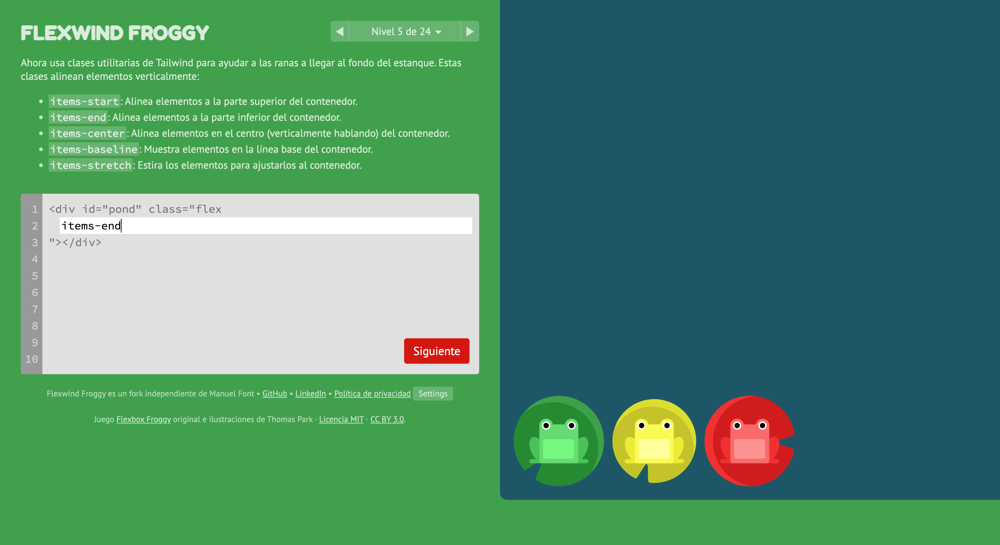

# Flexwind Froggy

Flexwind Froggy is a game for learning Tailwind CSS flex utilities. Check it out at [flexwindfroggy.com](https://flexwindfroggy.com).

This project is a fork of [thomaspark/flexboxfroggy](https://github.com/thomaspark/flexboxfroggy), created by [Thomas Park](https://github.com/thomaspark). Flexwind Froggy is an independently maintained, tailwind version of that project.

## Author

Manuel Font

- [GitHub](https://github.com/ManuelFont)
- [LinkedIn](https://www.linkedin.com/in/manuel-font-/)

## Copyright and License

Flexwind Froggy is a fork of [Thomas Park’s Flexbox Froggy](https://github.com/thomaspark/flexboxfroggy). The original code and associated copyright notices are released under the [MIT License](https://github.com/thomaspark/flexboxfroggy/blob/main/LICENSE), and the applicable MIT license and copyright notice are included in this repository’s [LICENSE](./LICENSE) file.

Copyright © 2015–2023 Thomas Park. Please preserve the upstream attribution, copyright notice, MIT license text, and other applicable third-party notices when copying or redistributing this project. Images are released under [Creative Commons](https://creativecommons.org/licenses/by/3.0/legalcode.txt), as noted by the upstream project.
